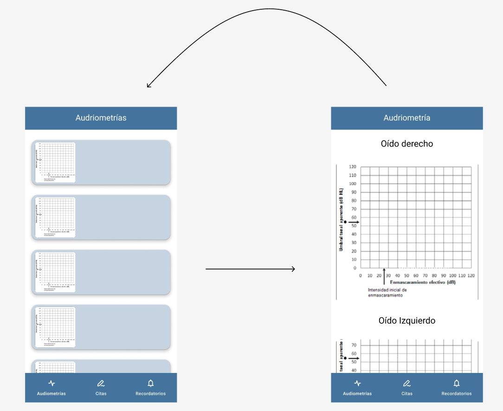

# Diseño 

Se busca un diseño cómodo y agradable para el usuario, además de cumplir con las funcionalidades clave necesarias:

1. **Interfaz clara y sencilla**

    La aplicación debe tener un diseño limpio y organizado, con botones y menús claramente visibles y fáciles de navegar. Además, debe adaptarse a usuarios con diferentes niveles de habilidad tecnológica, ofreciendo una experiencia sin complicaciones.

2. **Pantalla principal**

    La pantalla principal será la mas importante, en este caso el historial de las audiometrías.
    Esta pantalla debe ser clara, organizada y ofrecer una vista completa de los resultados, permitiendo a los usuarios acceder fácilmente a la información que necesitan.

3. **Citas médicas**

    El diseño de las citas tiene que ser sencillo y accesible.

4. **Colores Específicos para Daltonismo**

    La aplicación está diseñada con colores seleccionados para garantizar que sean accesibles para personas con daltonismo. Estos colores están diseñados para ofrecer un buen contraste y hacer que la información clave sea fácilmente legible

## Navegación 

1. **Mockups**

   Los siguientes modelos representativos de la aplicación han sido diseñados utilizando la herramienta [Figma](URL). Muestran la distribución de los elementos y la interacción prevista:

    
    
    
    

2. **Navegación entre pantallas**

La navegación dentro de la aplicación está diseñada para ser intuitiva y eficiente, utilizando un menú inferior como principal método de acceso a las tres secciones principales:

- **Audiometrías**: Muestra el historial de audiometrías registradas. Aqui, para acceder a una **audiometría** específica el usuario simplemente debe hacer clic sobre la audiometría deseada.

- **Citas**: Permite al usuario programar y gestionar sus citas médicas.

- **Recordatorios**: Lista todos los recordatorios creados por el usuario. La creación de un **recordatorio personalizado** es accesible a través de un botón flotante ubicado en la esquina inferior derecha de la pantalla

Acontinuacion una imagen del nav_graph de la aplicación:

